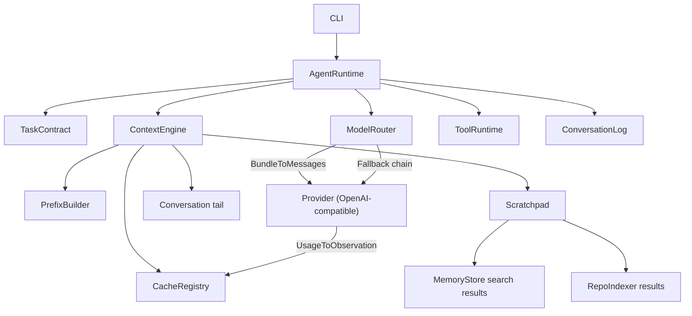

# ReasonForge Architecture

## Mission

ReasonForge is a local-first, cache-native AI coding agent runtime. The MVP does not try to be a complete agent product. It establishes stable boundaries for later implementations.

## Principles

1. Local First: config, indexes, memory, logs, and task state default to local storage.
2. OpenAI Compatible First: model calls go through one OpenAI-compatible provider abstraction.
3. Cache Native: the context engine is designed around prefix cache fingerprints.
4. Byte-Stable Prefix: system prompt, tool schema, and coding rules must be byte-stable.
5. Append-only Log: conversation and task events are appended, not rewritten.
6. Volatile Scratchpad: dynamic RAG, tool output, temporary reasoning, and repo snippets are volatile.
7. Worktree Safe: task contracts carry worktree isolation policy.
8. Observable Agent: model calls, tool calls, patches, tests, and rollbacks are events.
9. Minimal MVP: interfaces and boundaries first, complex behavior later.

## Directory Structure

```text
cmd/reasonforge/              CLI entry point
internal/cli/                 Minimal command handling
internal/config/              Local YAML config loading and validation
internal/prefix/              Byte-stable immutable prefix contract
internal/cache/               Prefix cache registry contract
internal/contextengine/       Context assembly contract
internal/conversation/        Append-only event log contract
internal/scratchpad/          Volatile context contract
internal/memory/              Local durable memory contract
internal/repoindex/           Local repository index contract
internal/model/               OpenAI-compatible model router contract
internal/modelrouter/         Model router implementation with fallback chain
internal/toolruntime/         Tool runtime compatibility aliases
internal/tools/               Tool runtime, registry, safety guard, audit log, built-in tools
internal/task/                Task contract and worktree policy
internal/worktree/            Git worktree isolation manager
internal/patch/               Patch preview, apply, and discard manager
internal/agent/               Agent runtime orchestration contract
internal/version/             Version metadata
docs/adr/                     Architecture decision records
```

Every module has a local README describing responsibilities, boundaries, and forbidden behavior.

## Runtime Layers



## Context Model

ReasonForge context is split into two layers.

Immutable prefix:

- System prompt.
- Sorted tool schemas.
- Coding rules.
- Byte-stable generated metadata.
- Prefix fingerprint and cache lookup key.

Volatile context:

- Conversation tail.
- Memory search results.
- RAG results.
- Tool outputs.
- Temporary reasoning.
- Repository index snippets.
- Task state summaries.

Dynamic material must never be merged into the immutable prefix. This is enforced at the configuration layer for `prefix.yaml` and should also be enforced by future prefix builder implementations.

`prefix.yaml` uses a strict immutable-source kind allowlist. MVP immutable sources may only be `static_file` or `generated_schema`. Filenames are not inspected for dynamic-content keywords because legitimate static policy files may discuss memory, retrieval, or tool behavior.

## Prefix Cache Design

`PrefixBuilder` produces a byte sequence and SHA-256 fingerprint. `CacheRegistry` stores observed provider cache references and cache usage metadata by that fingerprint.

The registry does not own prompt content. It stores observations such as provider, model, request ID, cached tokens, and provider cache references. This keeps prefix cache behavior observable without making provider-specific assumptions.

TODO:

- ~~Implement a deterministic prefix builder with LF normalization.~~ (Done in Phase 1)
- ~~Add schema sorting and canonical JSON generation for tool schemas.~~ (Done in Phase 1)
- ~~Add provider cache hit/miss metrics.~~ (Done in Phase 1)
- ~~Add local JSONL cache registry storage.~~ (Done in Phase 1)

## Model Router

The Model Router (`internal/modelrouter/`) is responsible for converting a `ContextEngine.Bundle` into an OpenAI-compatible completion request, selecting a provider via fallback chain, calling the provider, and recording usage into the CacheRegistry.

Key components:

- **ModelRouter interface**: `Complete(ctx, CompletionRequest) (CompletionResponse, error)` — the main entry point.
- **Provider interface**: `Complete`, `Name`, `Supports` — implemented by `OpenAICompatibleProvider` and `MockProvider`.
- **BundleToMessages**: Converts `Bundle.Layers` into OpenAI-compatible messages with stable ordering (immutable_prefix → conversation_log → scratchpad → current_input).
- **DefaultModelRouter**: Implements fallback chain logic. Tries providers in configured order; returns `FallbackError` on all-fail.
- **UsageToObservation**: Converts `Usage` + `Bundle` into `cache.Observation` for CacheRegistry writeback.
- **OpenAICompatibleProvider**: HTTP-based provider using `net/http`. Reads API keys from environment variables. Never logs or exposes keys.

The router does NOT read project files directly or bypass `ContextEngine.Bundle`.

Fallback chain configuration lives in `models.yaml` under `routing.fallback_chain`. If missing, a single-entry chain is derived from `default_model`.

API key security: keys are read from environment variables, never logged, never included in error messages, and the `reasonforge models` command only shows `configured`/`missing` status.

See `docs/phase-2-model-router.md` for full documentation.

## Tool Runtime

The Tool Runtime (`internal/tools/`) provides a secure local tool execution layer. All tool invocations must go through `ToolRuntime.Run()` — no business code calls a Tool implementation directly.

Key components:

- **ToolRuntime interface**: `Run(ctx, ToolRequest) (ToolResponse, error)` — the central orchestrator.
- **Tool interface**: `Name`, `Description`, `RiskLevel`, `Run` — implemented by each built-in tool.
- **ToolRegistry**: In-memory registry with duplicate rejection. `Register`, `Get`, `List`.
- **SafetyGuard**: Enforces workspace root confinement, sensitive path protection, output limits, timeouts.
- **AuditLog**: JSONL audit trail with crypto/rand IDs and content redaction.
- **Built-in tools**: `file_read`, `file_write`, `file_patch`, `git_diff`, `test_run`.

Safety boundaries:
- All file paths must stay within RepoRoot (no `..`, no absolute paths, no Windows drive letters).
- `.git/`, `.reasonforge/`, `.env`, `*.pem`, `*.key`, `id_rsa`, `id_ed25519` are write-denied.
- `.env`, `*.pem`, `*.key`, `id_rsa`, `id_ed25519` are read-denied.
- `test_run` only executes predefined commands from `tools.yaml`; no arbitrary shell commands.
- Minimal environment inheritance (no API keys passed to subprocesses).
- Audit log directory: 0700, file: 0600.

See `docs/phase-3-tool-runtime.md` for full documentation.

## Append-only Log

`ConversationLog` exposes append and read operations. There is no update or delete method. Events include:

- User and assistant messages.
- Model calls.
- Tool calls.
- Patches.
- Test runs.
- Rollbacks.
- Task state transitions.

TODO:

- ~~Implement a local JSONL conversation log.~~ (Done in Phase 1)
- Add event IDs and integrity checks.
- Add log compaction as a separate derived artifact, never as in-place history rewrite.

## Config

`reasonforge init` creates `.reasonforge/` with:

- `models.yaml`
- `tools.yaml`
- `security.yaml`
- `prefix.yaml`
- `worktree.yaml` (Phase 5)
- `patch.yaml` (Phase 5)

`reasonforge doctor` loads all files with strict YAML parsing and validates key safety constraints. The default model provider is OpenAI-compatible and local by default.

`reasonforge init` writes default config files with owner-only permissions where the platform supports them. The files should contain provider names, environment variable names, and policies, not secret values.

TODO:

- Add config version migration.
- Add config provenance and loaded file digests.
- Add security profile validation for tool permissions.

## Worktree Isolation

`WorktreeManager` (`internal/worktree/`) creates and manages isolated git worktrees for agent task execution. All worktrees live under `.reasonforge/worktrees/` with a JSONL registry for tracking.

Key components:
- **WorktreeManager interface**: `Create`, `Remove`, `Get`, `List`, `UpdateState`
- **GitWorktreeManager**: Implements worktree operations using git commands
- **Registry**: Append-only JSONL with 0700/0600 permissions, no API keys

Branch naming follows the pattern: `reasonforge/<sanitized_task_id>/<short_id>`

## Patch Manager

`PatchManager` (`internal/patch/`) handles diff preview, violation checking, and patch application from worktrees to the main workspace.

Key components:
- **PatchManager interface**: `Preview`, `Apply`, `Discard`
- **GitPatchManager**: Uses git diff/apply for patch operations
- **Violation checking**: TaskContract AllowedPaths/DeniedPaths + hard-coded deny list
- **Safety**: Apply refuses if violations exist or main workspace is dirty

CLI commands:
- `reasonforge run --worktree` - Run agent in isolated worktree
- `reasonforge patch list` - List managed worktrees
- `reasonforge patch preview <id>` - Show diff and violations
- `reasonforge patch apply <id>` - Apply changes to main workspace
- `reasonforge patch discard <id>` - Remove worktree

See `docs/phase-5-worktree-patch-manager.md` for full documentation.

## Observability

Every consequential action should become an append-only event:

- Model request and response metadata.
- Tool invocation and result metadata.
- Patch application.
- Test command and result.
- Rollback decision and result.
- Cache usage observation.

TODO:

- Add structured event payload schemas.
- Add trace IDs that connect context bundles, model calls, tool calls, and patches.
- Add local inspection commands.

## Non-goals

- No LangChain.
- No UI.
- No microservices.
- No Docker, K8s, SSH, or DB tooling in the MVP.
- No remote-first storage assumptions.
- No direct memory injection into the main prompt.
