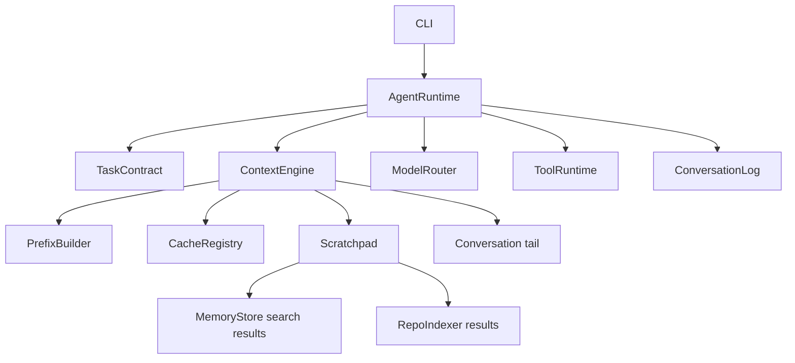

# ReasonForge Architecture

## Mission

ReasonForge is a local-first, cache-native AI coding agent runtime. The MVP does not try to be a complete agent product. It establishes stable boundaries for later implementations.

## Principles

1. Local First: config, indexes, memory, logs, and task state default to local storage.
2. OpenAI Compatible First: model calls go through one OpenAI-compatible provider abstraction.
3. Cache Native: the context engine is designed around prefix cache fingerprints.
4. Byte-Stable Prefix: system prompt, tool schema, and coding rules must be byte-stable.
5. Append-only Log: conversation and task events are appended, not rewritten.
6. Volatile Scratchpad: dynamic RAG, tool output, temporary reasoning, and repo snippets are volatile.
7. Worktree Safe: task contracts carry worktree isolation policy.
8. Observable Agent: model calls, tool calls, patches, tests, and rollbacks are events.
9. Minimal MVP: interfaces and boundaries first, complex behavior later.

## Directory Structure

```text
cmd/reasonforge/              CLI entry point
internal/cli/                 Minimal command handling
internal/config/              Local YAML config loading and validation
internal/prefix/              Byte-stable immutable prefix contract
internal/cache/               Prefix cache registry contract
internal/contextengine/       Context assembly contract
internal/conversation/        Append-only event log contract
internal/scratchpad/          Volatile context contract
internal/memory/              Local durable memory contract
internal/repoindex/           Local repository index contract
internal/model/               OpenAI-compatible model router contract
internal/toolruntime/         Tool schema and execution contract
internal/task/                Task contract and worktree policy
internal/agent/               Agent runtime orchestration contract
internal/version/             Version metadata
docs/adr/                     Architecture decision records
```

Every module has a local README describing responsibilities, boundaries, and forbidden behavior.

## Runtime Layers



## Context Model

ReasonForge context is split into two layers.

Immutable prefix:

- System prompt.
- Sorted tool schemas.
- Coding rules.
- Byte-stable generated metadata.
- Prefix fingerprint and cache lookup key.

Volatile context:

- Conversation tail.
- Memory search results.
- RAG results.
- Tool outputs.
- Temporary reasoning.
- Repository index snippets.
- Task state summaries.

Dynamic material must never be merged into the immutable prefix. This is enforced at the configuration layer for `prefix.yaml` and should also be enforced by future prefix builder implementations.

`prefix.yaml` uses a strict immutable-source kind allowlist. MVP immutable sources may only be `static_file` or `generated_schema`. Filenames are not inspected for dynamic-content keywords because legitimate static policy files may discuss memory, retrieval, or tool behavior.

## Prefix Cache Design

`PrefixBuilder` produces a byte sequence and SHA-256 fingerprint. `CacheRegistry` stores observed provider cache references and cache usage metadata by that fingerprint.

The registry does not own prompt content. It stores observations such as provider, model, request ID, cached tokens, and provider cache references. This keeps prefix cache behavior observable without making provider-specific assumptions.

TODO:

- Implement a deterministic prefix builder with LF normalization.
- Add schema sorting and canonical JSON generation for tool schemas.
- Add provider cache hit/miss metrics.
- Add local JSONL cache registry storage.

## Append-only Log

`ConversationLog` exposes append and read operations. There is no update or delete method. Events include:

- User and assistant messages.
- Model calls.
- Tool calls.
- Patches.
- Test runs.
- Rollbacks.
- Task state transitions.

TODO:

- Implement a local JSONL conversation log.
- Add event IDs and integrity checks.
- Add log compaction as a separate derived artifact, never as in-place history rewrite.

## Config

`reasonforge init` creates `.reasonforge/` with:

- `models.yaml`
- `tools.yaml`
- `security.yaml`
- `prefix.yaml`

`reasonforge doctor` loads all four files with strict YAML parsing and validates key safety constraints. The default model provider is OpenAI-compatible and local by default.

`reasonforge init` writes default config files with owner-only permissions where the platform supports them. The files should contain provider names, environment variable names, and policies, not secret values.

TODO:

- Add config version migration.
- Add config provenance and loaded file digests.
- Add security profile validation for tool permissions.

## Worktree Safety

`TaskContract` carries a `WorktreePolicy`. The MVP does not create worktrees yet, but the runtime contract requires worktree policy before task execution. Future agent implementations should refuse repository mutation when a task requires a worktree and one cannot be prepared.

TODO:

- Add worktree manager interface.
- Add branch naming policy.
- Add cleanup and rollback events.

## Observability

Every consequential action should become an append-only event:

- Model request and response metadata.
- Tool invocation and result metadata.
- Patch application.
- Test command and result.
- Rollback decision and result.
- Cache usage observation.

TODO:

- Add structured event payload schemas.
- Add trace IDs that connect context bundles, model calls, tool calls, and patches.
- Add local inspection commands.

## Non-goals

- No LangChain.
- No UI.
- No microservices.
- No Docker, K8s, SSH, or DB tooling in the MVP.
- No remote-first storage assumptions.
- No direct memory injection into the main prompt.
